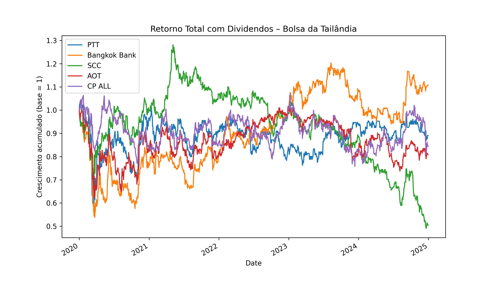

````markdown
# 📊 Thai Stock Market Portfolio Simulation  

  

## 🇧🇷 Versão em Português  

### 📌 Descrição  
Este projeto realiza a **análise de empresas listadas na bolsa da Tailândia (SET)**, considerando **retorno de preços + dividendos reais**.  
O resultado inclui:  
- 📊 **Relatório Executivo em PDF (Português e Inglês)**  
- 📈 **Gráfico da evolução da carteira**  
- 📝 **Métricas de desempenho**: Retorno total, CAGR, Volatilidade e Índice de Sharpe  

---

### 🚀 Como Rodar  

```bash
# 1. Instale os pré-requisitos
pip install yfinance pandas matplotlib reportlab

# 2. Salve o script com o nome:
simulacao_carteira_tailandia.py

# 3. Execute no terminal
python simulacao_carteira_tailandia.py
````

📂 **Saídas geradas automaticamente** na mesma pasta:

* `Relatorio_Executivo_Tailandia_PT.pdf` ✅
* `Executive_Report_Thailand_EN.pdf` ✅
* `retornos_tailandia.png` ✅

---

### 📑 Estrutura do Relatório

* **Resumo Executivo**
* **Tabela com métricas financeiras**
* **Conclusão executiva**

---

### 📈 Exemplos de uso

✔️ Análise acadêmica
✔️ Relatórios de consultoria
✔️ Investidores institucionais que buscam exposição em mercados emergentes

---

### 🛠️ Roadmap (Próximos Passos)

* [ ] Adicionar **backtesting** com diferentes pesos de alocação
* [ ] Implementar **otimização de portfólio (Markowitz / Efficient Frontier)**
* [ ] Incluir análise de **Value at Risk (VaR)** e métricas de downside risk
* [ ] Criar **dashboard interativo** em Streamlit para visualização online
* [ ] Conectar com API de dados em tempo real para relatórios dinâmicos

---

---

## 🇬🇧 English Version

### 📌 Description

This project performs an **analysis of Thai Stock Exchange (SET) companies**, considering **price returns + actual dividends**.
The output includes:

* 📊 **Executive Report in PDF (English & Portuguese)**
* 📈 **Portfolio performance chart**
* 📝 **Performance metrics**: Total Return, CAGR, Volatility, Sharpe Ratio

---

### 🚀 How to Run

```bash
# 1. Install dependencies
pip install yfinance pandas matplotlib reportlab

# 2. Save the script as:
simulacao_carteira_tailandia.py

# 3. Run in terminal
python simulacao_carteira_tailandia.py
```

📂 **Outputs automatically generated** in the same folder:

* `Relatorio_Executivo_Tailandia_PT.pdf` ✅
* `Executive_Report_Thailand_EN.pdf` ✅
* `retornos_tailandia.png` ✅

---

### 📑 Report Structure

* **Executive Summary**
* **Table with financial metrics**
* **Executive conclusion**

---

### 📈 Use cases

✔️ Academic analysis
✔️ Consulting reports
✔️ Institutional investors seeking exposure to emerging markets

---

### 🛠️ Roadmap (Next Steps)

* [ ] Add **backtesting** with different allocation weights
* [ ] Implement **portfolio optimization (Markowitz / Efficient Frontier)**
* [ ] Include **Value at Risk (VaR)** and downside risk metrics
* [ ] Create **interactive dashboard** using Streamlit
* [ ] Connect with real-time market data API for dynamic reports

---

## 📌 Licença

Este projeto é de uso livre para fins **acadêmicos e de consultoria**.
This project is free to use for **academic and consulting purposes**.

---